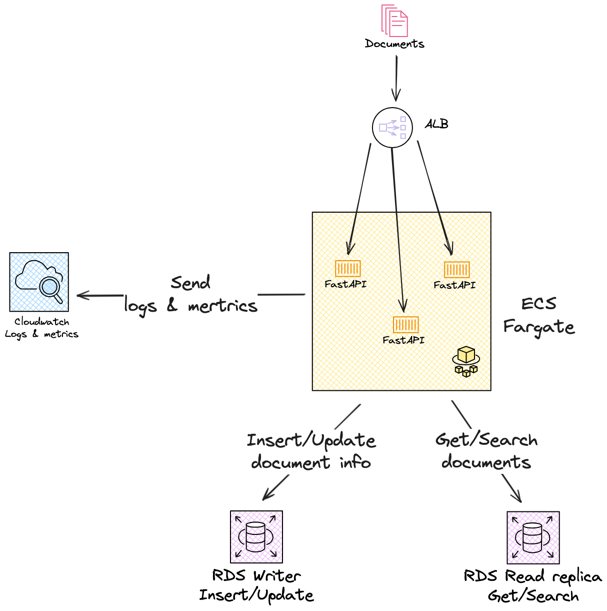
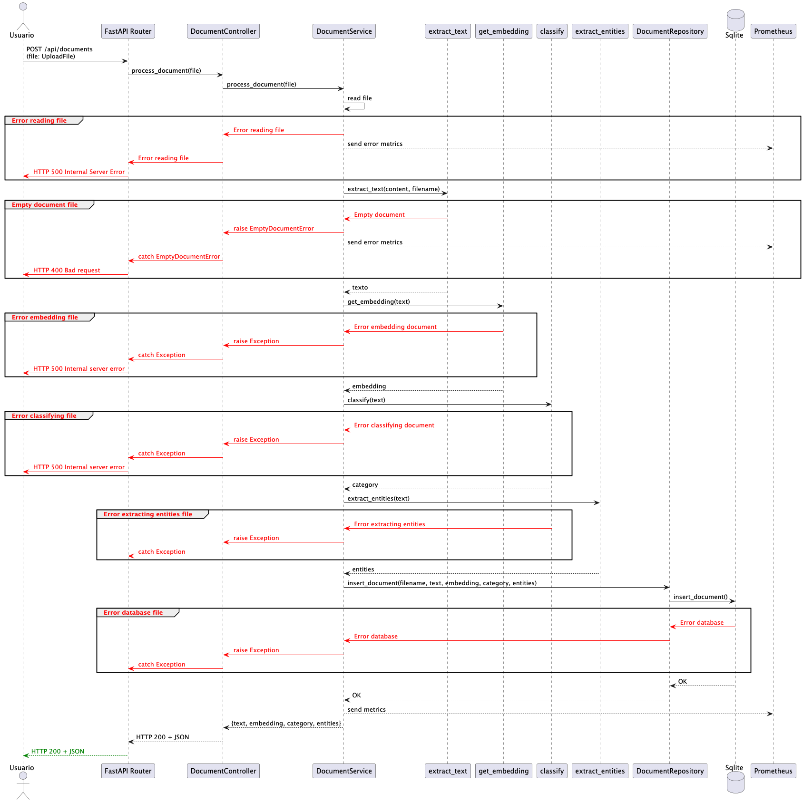
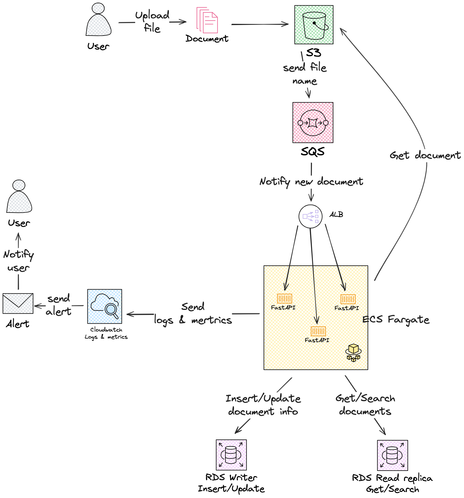

# Documento de ánalisis de la API

Una API escalable para análisis de documentos usando técnicas de NLP e IA. Permite subir documentos PDF, DOCX o JSON, procesarlos para extraer texto, generar embeddings, clasificarlos, extraer entidades, y realizar búsqueda semántica.

## 🧱 Arquitectura

- **FastAPI**: Framework para construir la API web.
- **SQLite**: Base de datos ligera para almacenamiento local.
- **Docker + Docker Compose**: Entorno de desarrollo reproducible.
- **Prometheus + Grafana**: Monitoreo y visualización de métricas.
- **spaCy**: Procesamiento de lenguaje natural.
- **Sentence-Transformers**: Generación de embeddings.
- **scikit-learn**: Clasificación de documentos.
- **pytest**: Pruebas unitarias e integración.

## 📦 Instalación

### Requisitos

- Docker y Docker Compose instalados

### Paso 1: Clonar el repositorio

```bash
git clone https://github.com/tu_usuario/document-analysis-api.git
cd document-analysis-api
```

### Paso 2: Levantar el entorno
```bash
docker compose up --build
```
Esto inicia:

- document-api: FastAPI en http://localhost:8000
- prometheus: En http://localhost:9090
- grafana: En http://localhost:3000 (usuario: admin, contraseña: admin)

## 🚀 Endpoints
| Método   | Ruta                               | Descripción |
|----------|------------------------------------|-------------|
| POST  | **/api/process**                  | Procesa un documento subido  |
| GET  | **/api/document/{id}**             | Recupera un documento por ID  |
| GET  | **/api/search?query=texto&top_k=3** | Búsqueda semántica  |
| GET  | **/metrics**                       | Métricas Prometheus |
		
### 📤 1. Procesar un documento (POST /api/documents)
```bash
curl -X POST http://localhost:8000/api/process \
  -H "accept: application/json" \
  -H "Content-Type: multipart/form-data" \
  -F "file=@contrato_simple.docx"
```
🔁 Reemplaza `ruta/al/archivo.docx` con la ruta a un archivo `.docx`, `.pdf` o `.json`.

### 📄 2. Obtener un documento por ID (GET /api/documents/{id})
```bash
curl -X GET http://localhost:8000/api/document/1 \
  -H "accept: application/json"
```
🔁 Reemplaza 1 con el ID del documento que quieres consultar.

### 🔍 3. Búsqueda semántica (GET /api/search?query=texto&top_k=3)
```bash
curl -X GET "http://localhost:8000/api/search?query=contrato laboral&top_k=3" \
  -H "accept: application/json"
```
🔁 Cambia el valor de `query` por tu término de búsqueda y `top_k` por el número de resultados deseado.

## 🧠 Modelos y Justificación
#### Embeddings
- Modelo: all-MiniLM-L6-v2 (de sentence-transformers)
- Razón: Rápido, eficiente, buena precisión para clasificación y búsqueda.

#### Clasificación
- Basado en TfidfVectorizer + SGDClassifier (con SVM). 
- Puede mejorarse con modelos como fine-tuned BERT.

#### NER
- Actualmente usando en_core_web_sm de spaCy. 
- Puede personalizarse con entrenamiento adicional sobre tus dominios.

# 🔬 Pruebas
```bash
# Dentro del contenedor
pytest
```

Se cubren los siguientes componentes:

- Repositorio SQLite 
- Servicios (procesamiento, clasificación, embeddings)
- Controladores FastAPI

# 📈 Monitoreo
- Prometheus expone métricas como:
  - documents_processed_total 
  - document_processing_seconds
- Grafana permite visualizarlas con dashboards personalizables.

# 📐 Escalabilidad (Diseño Cloud Ready)
- Separar cada componente como microservicio (procesamiento, embeddings, NER, etc.)
- Usar almacenamiento en S3 y base de datos en RDS 
- Colas de procesamiento 

# 📊 Diagramas 
## Arquitectura 

## Secuencia


# 🧪 Mejoras Futuras
- Entrenamiento de modelo NER personalizado 
- Caching de resultados con Redis 
- A/B testing de clasificadores
- Métricas más detalladas (tiempo por componente)
- Autenticación

Se propone mejorar la arquitectura en AWS incorporando un bucket S3 que, 
al recibir un nuevo documento, genere automáticamente un evento hacia una 
cola SQS. Esta cola enviará un mensaje con la 
información necesaria (como el nombre del archivo) para que la aplicación consuma ese mensaje, descargue el documento desde S3 y lo procese de manera asíncrona. Esta mejora permite desacoplar la carga de archivos del procesamiento, facilitando la escalabilidad y la tolerancia a fallos del sistema.



# 📝 Notas
- Documentación OpenAPI en http://localhost:8000/docs
- Usa .env para configuración sensible si decides escalar

